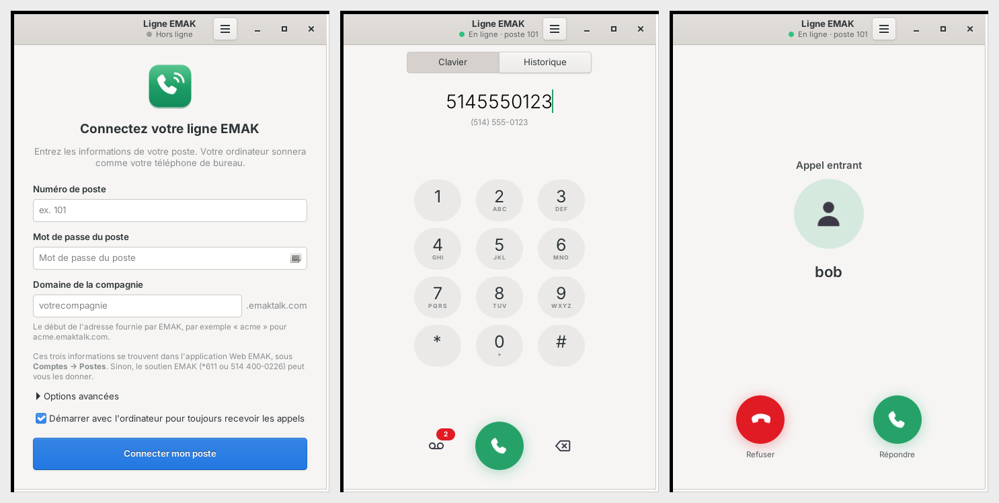

# Ligne EMAK

**Votre poste EMAK Telecom sur votre ordinateur Linux (Zorin OS, Ubuntu).**

Ligne EMAK transforme votre ordinateur en téléphone de bureau branché sur votre poste EMAK :
appels sortants, appels entrants avec notification et sonnerie, messagerie vocale, mise en
attente, transfert, clavier pendant l'appel et historique.



> Projet communautaire indépendant, **non affilié à EMAK Telecom**. Il utilise le protocole SIP
> standard, celui des téléphones Yealink et des applications mobiles qu'EMAK prend en charge.

## Installation

Compatible Zorin OS 17 et 18, Ubuntu 22.04 et 24.04 (et dérivées).

1. Téléchargez le fichier `ligne-emak_…_all.deb` de la dernière version, dans la section
   **Releases** de cette page.
2. Double-cliquez dessus, puis cliquez sur **Installer**. En terminal :

   ```
   sudo apt install ./ligne-emak_1.0.0_all.deb
   ```

   Le moteur téléphonique `baresip` s'installe automatiquement depuis les dépôts officiels.
3. Ouvrez **Ligne EMAK** depuis le menu des applications.

## Vos identifiants EMAK

Trois informations sont nécessaires. Elles se trouvent dans l'application Web EMAK sous
**Comptes → Postes**, sinon le soutien EMAK peut vous les donner (`*611` depuis un téléphone
EMAK, ou 514 400-0226) :

| Champ | Exemple |
|---|---|
| Numéro de poste | `101` |
| Mot de passe du poste | celui du poste (pas celui de votre compte Web) |
| Domaine de la compagnie | `acme` pour `acme.emaktalk.com` |

Le mot de passe est rangé dans le trousseau de clés de votre session (application
« Mots de passe et clés »), jamais en clair dans le fichier de réglages.

## Au quotidien

- **Appeler** : tapez le numéro au clavier de l'ordinateur ou cliquez les touches, puis
  **Entrée** ou le bouton vert. Entrée sur un champ vide remet le dernier numéro composé.
- **Recevoir** : la fenêtre s'ouvre et une notification propose Répondre / Refuser.
- **Pendant l'appel** : Muet, Attente, Clavier (menus vocaux), Transférer (transfert immédiat
  vers un poste ou un numéro).
- **Messagerie vocale** : bouton à gauche du bouton vert (compose `*97`). Une pastille rouge
  indique les nouveaux messages.
- **Fermer la fenêtre** ne coupe pas la ligne : vous continuez à recevoir vos appels. Pour tout
  arrêter : menu ☰ → **Quitter**.
- **Démarrer avec l'ordinateur** : option du menu ☰ (activée par défaut à la configuration).
- Les liens `tel:` des pages Web peuvent s'ouvrir directement dans Ligne EMAK.

## Si quelque chose ne va pas

| Problème | Solution |
|---|---|
| « EMAK refuse le poste ou le mot de passe » | Vérifiez les trois champs dans ☰ → Paramètres du poste. Le mot de passe respecte les majuscules. |
| « Le serveur EMAK ne répond pas » | Vérifiez Internet et le domaine de la compagnie. |
| On ne m'entend pas / je n'entends rien | Choisissez le micro et le haut-parleur dans **Paramètres → Son** (Ligne EMAK utilise ceux par défaut). |
| Le son ne passe que dans un sens | Désactivez le « SIP ALG » de votre routeur (recommandation d'EMAK). |
| Les appels entrants arrêtent de sonner après un moment | ☰ → Paramètres du poste → Options avancées → **TCP**. |
| Écho chez votre interlocuteur | Utilisez un casque ou des écouteurs plutôt que les haut-parleurs. |

Le journal technique (☰ → Journal technique) aide à diagnostiquer un problème ; il ne contient
jamais le mot de passe. Joignez-le si vous ouvrez un ticket (*Issues*).

**911** : comme pour toute ligne EMAK, un appel au 911 depuis ce poste est associé à l'adresse
enregistrée chez EMAK pour ce poste. Si vous utilisez l'ordinateur ailleurs, faites mettre à jour
l'adresse auprès d'EMAK.

## Désinstaller

```
sudo apt remove ligne-emak
```

Vos réglages restent dans `~/.config/ligne-emak` ; supprimez ce dossier pour tout effacer.

## Pour les développeurs

```
src/ligne_emak/
  engine.py   pilotage de baresip (processus, console de contrôle, événements)
  app.py      application GTK : fenêtre, logique d'appel, notifications, icône de barre
  ui.py       widgets : formulaire, clavier, écrans d'appel, historique
  store.py    réglages, trousseau (libsecret), historique, démarrage automatique
data/         feuille de style GTK, icônes, lanceur .desktop
debian/       métadonnées du paquet
tests/        faux PBX SIP + test de bout en bout du moteur
```

**Lancer depuis les sources** (Zorin / Ubuntu) :

```
sudo apt install python3-gi gir1.2-gtk-3.0 gir1.2-secret-1 baresip-core
PYTHONPATH=src python3 -m ligne_emak
```

**Fabriquer le paquet** : `./build-deb.sh` produit `build/ligne-emak_<version>_all.deb`.

**Tester** : `python3 tests/test_engine.py` démarre un faux serveur EMAK et un second baresip
sur 127.0.0.1, puis vérifie enregistrement, appels, DTMF, muet, attente et messagerie. Aucune carte
son ni compte EMAK n'est nécessaire.

**Fonctionnement** :

- Interface en Python 3 + GTK 3 ; moteur SIP **baresip 1.0** (paquet `baresip-core` des dépôts),
  piloté par sa console de contrôle JSON locale (127.0.0.1 uniquement).
- Le mot de passe n'est transmis à baresip que dans un dossier privé en mémoire
  (`$XDG_RUNTIME_DIR`), effacé dès que baresip l'a lu.
- SIP en UDP (ré-enregistrement chaque minute pour le NAT) ou TCP (RFC 5626) ;
  codecs G.722, G.711, Opus ; son via ALSA « default » (PulseAudio / PipeWire).
- Le module de messagerie (`mwi`) de baresip 1.0 peut boucler si l'enregistrement aboutit avant
  son minuteur de démarrage : il est donc chargé seulement après le premier enregistrement réussi.
- Après un changement de réseau ou une sortie de veille, le moteur est relancé (hors appel).

Les contributions sont bienvenues : ouvrez un ticket ou une *pull request*.

## In English

Ligne EMAK is an unofficial desktop softphone for EMAK Telecom (Montréal) business phone lines on
Linux (Zorin OS / Ubuntu). Download the `.deb` from **Releases**, install it, then enter your
extension number, extension password and company domain (`yourcompany.emaktalk.com`). It is a
GTK 3 front end driving baresip; the UI is in French.

## Licence

MIT — voir [LICENSE](LICENSE). Le moteur baresip est distribué séparément sous sa propre licence (BSD).
